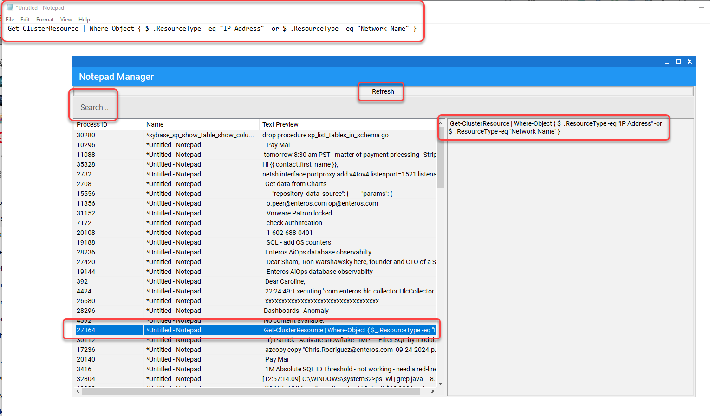

# Notepad Manager

## Description
Notepad Manager is a Windows application designed to track and manage open Notepad instances. It helps users keep important pieces of information easily accessible, preventing data loss from unsaved Notepad windows. 



With this tool, users can:
- Preview open Notepad windows.
- Restore unsaved notes after a system reboot.
- Efficiently manage multiple open Notepad instances without losing track.

## Features
- List all open Notepad instances.
- Double-click to preview and reopen notes.
- Automatic restoration of unsaved notes after application start.
- User-friendly interface for both technical and non-technical users.

## Installation

### Prerequisites
- Windows operating system.
- .NET Framework 4.5 or higher.

### Steps
1. Clone the repository:
   ```bash
   git clone https://github.com/ronwarshawsky/ManageNotepadWindows.git
   ```
2. Navigate to the project directory:
   ```bash
   cd ManageNotepadWindows
   ```
3. Build the application using Visual Studio.
4. Run the executable from the build output directory.

## Usage
1. Launch the application.
2. The application will automatically scan for open Notepad instances and display them in a list.
3. Click on any entry to preview the content of the Notepad.
4. Double-click on any entry to bring up Notepad windows.
5. In case of a system reboot, reopen the application to restore unsaved Notepad instances automatically.

## Contributing
We welcome contributions from the community! To contribute to this project, please follow these steps:
1. Fork the repository.
2. Create a new branch:
   ```bash
   git checkout -b feature/YourFeatureName
   ```
3. Make your changes and commit them:
   ```bash
   git commit -m "Add some feature"
   ```
4. Push to the branch:
   ```bash
   git push origin feature/YourFeatureName
   ```
5. Open a pull request.

## License
This project is licensed under the MIT License. See the [LICENSE](LICENSE) file for more details.

## Acknowledgements
- Inspired by the challenges users face in managing multiple unsaved Notepad instances.
- Contributions and feedback from the user community are always appreciated!
